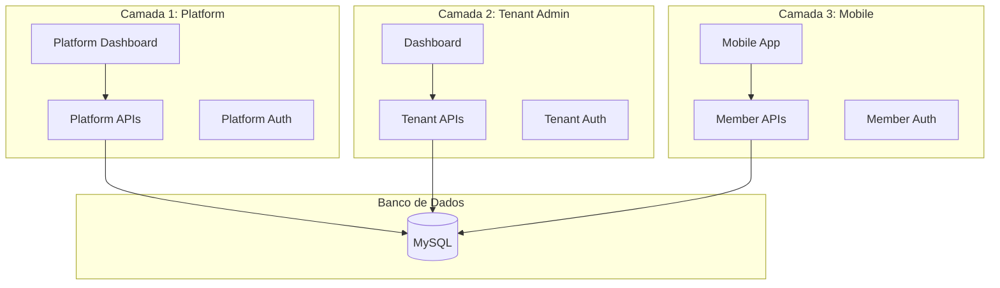
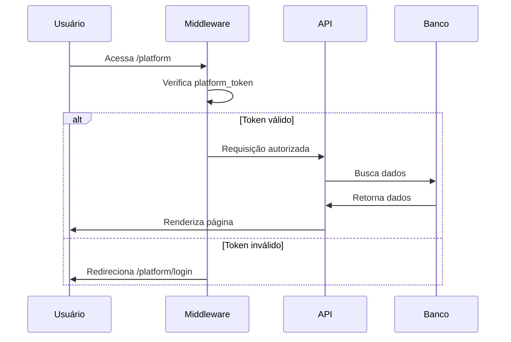

# 📋 Detalhamento dos Próximos Passos

## 🎯 Visão Geral

Este documento detalha os 3 próximos passos sugeridos para melhorar a arquitetura do sistema, mantendo a separação lógica mas eliminando duplicação e melhorando segurança.

---

## 1️⃣ Completar Migração `/dashboard/admin` → `/platform`

### 📊 Situação Atual

**Problema:** Existe código duplicado em dois lugares:

```
❌ app/dashboard/admin/          → Código antigo (duplicado)
   ├── page.tsx                  → Dashboard admin
   ├── tenants/page.tsx          → Lista de tenants
   ├── tenants/new/page.tsx      → Criar tenant
   ├── plans/page.tsx            → Gerenciar planos
   └── churches/page.tsx         → Lista de igrejas

✅ app/platform/                 → Código novo (correto)
   ├── page.tsx                  → Dashboard plataforma
   ├── tenants/page.tsx          → Lista de tenants
   ├── tenants/new/page.tsx      → Criar tenant
   └── plans/page.tsx            → Gerenciar planos
```

**APIs também duplicadas:**
```
❌ app/api/admin/                → APIs antigas (duplicadas)
   ├── stats/route.ts
   ├── churches/route.ts
   ├── plans/route.ts
   └── modules/route.ts

✅ app/api/platform/             → APIs novas (corretas)
   ├── stats/route.ts
   ├── tenants/route.ts
   ├── plans/route.ts
   └── modules/route.ts
```

### 🔍 O Que Precisa Ser Feito

#### Passo 1: Verificar Diferenças

Comparar os arquivos duplicados para garantir que `/platform` tem todas as funcionalidades:

```bash
# Comparar dashboards
diff app/dashboard/admin/page.tsx app/platform/page.tsx

# Comparar APIs
diff app/api/admin/stats/route.ts app/api/platform/stats/route.ts
```

#### Passo 2: Migrar Funcionalidades Faltantes

Se `/dashboard/admin/page.tsx` tiver funcionalidades que `/platform/page.tsx` não tem (ex: aniversariantes), migrar:

```typescript
// Exemplo: Adicionar aniversariantes em /platform/page.tsx
// Copiar código de app/dashboard/admin/page.tsx
```

#### Passo 3: Atualizar Referências

Buscar e atualizar todas as referências:

```bash
# Buscar referências a /dashboard/admin
grep -r "/dashboard/admin" app/
grep -r "/api/admin" app/

# Buscar referências a /api/admin
grep -r "/api/admin" app/
```

**Arquivos que precisam ser atualizados:**
- Componentes que fazem links
- Sidebar
- Navegação
- Redirecionamentos

#### Passo 4: Remover Código Antigo

Depois de migrar tudo e testar:

```bash
# Remover diretórios antigos
rm -rf app/dashboard/admin/
rm -rf app/api/admin/
```

### ✅ Benefícios

- ✅ Elimina código duplicado
- ✅ Reduz manutenção (um lugar para atualizar)
- ✅ Evita bugs por inconsistências
- ✅ Código mais limpo e organizado

### ⚠️ Cuidados

- ⚠️ Testar todas as funcionalidades antes de remover
- ⚠️ Verificar se não há links externos apontando para `/dashboard/admin`
- ⚠️ Garantir que todas as funcionalidades foram migradas

---

## 2️⃣ Melhorar Middleware de Autenticação por Camada

### 📊 Situação Atual

O middleware atual (`middleware.ts`) já tem alguma separação, mas pode ser melhorado:

**O que já funciona:**
- ✅ Separação de cookies (`platform_token` vs `church_token`)
- ✅ Bloqueio básico de acesso cruzado
- ✅ Redirecionamento para login correto

**O que pode melhorar:**
- ⚠️ Verificação de `isPlatformAdmin` não está sendo feita
- ⚠️ Verificação de permissões por módulo não está no middleware
- ⚠️ Logs podem ser mais informativos
- ⚠️ Tratamento de erros pode ser melhor

### 🔍 O Que Precisa Ser Feito

#### Passo 1: Adicionar Verificação de `isPlatformAdmin`

```typescript
// middleware.ts
if (isPlatformRoute || isApiPlatform) {
  const platformToken = request.cookies.get('platform_token')?.value
  if (!platformToken) {
    return NextResponse.redirect(new URL('/platform/login', request.url))
  }
  
  const payload = await verifyToken(platformToken)
  if (!payload) {
    return NextResponse.redirect(new URL('/platform/login', request.url))
  }
  
  // NOVO: Verificar se é realmente platform admin
  // Buscar no banco ou adicionar flag no JWT
  if (!payload.isPlatformAdmin) {
    return NextResponse.json(
      { error: 'Acesso negado. Apenas administradores da plataforma.' },
      { status: 403 }
    )
  }
}
```

#### Passo 2: Melhorar Verificação de Permissões do Tenant

```typescript
// middleware.ts
if (isDashboardRoute) {
  const churchToken = request.cookies.get('church_token')?.value
  if (!churchToken) {
    return NextResponse.redirect(new URL('/login', request.url))
  }
  
  const payload = await verifyToken(churchToken)
  if (!payload || !payload.churchId) {
    return NextResponse.redirect(new URL('/login', request.url))
  }
  
  // NOVO: Verificar se o módulo está ativo para a igreja
  // Isso pode ser feito via cache ou verificação rápida
  const moduleKey = getModuleFromRoute(request.nextUrl.pathname)
  if (moduleKey && !await hasModuleAccess(payload.churchId, moduleKey)) {
    return NextResponse.json(
      { error: 'Módulo não disponível no seu plano' },
      { status: 403 }
    )
  }
}
```

#### Passo 3: Adicionar Rate Limiting por Camada

```typescript
// middleware.ts
// Rate limiting diferente por camada
if (isPlatformRoute) {
  // Platform: menos requisições (poucos usuários)
  await rateLimit(request, { max: 100, window: '1m' })
} else if (isDashboardRoute) {
  // Dashboard: mais requisições (muitos usuários)
  await rateLimit(request, { max: 500, window: '1m' })
}
```

#### Passo 4: Melhorar Logs e Monitoramento

```typescript
// middleware.ts
// Logs estruturados por camada
if (isPlatformRoute) {
  console.log('[PLATFORM]', {
    path: request.nextUrl.pathname,
    user: payload.email,
    timestamp: new Date().toISOString()
  })
} else if (isDashboardRoute) {
  console.log('[TENANT]', {
    path: request.nextUrl.pathname,
    user: payload.email,
    churchId: payload.churchId,
    timestamp: new Date().toISOString()
  })
}
```

### ✅ Benefícios

- ✅ Segurança mais robusta
- ✅ Melhor controle de acesso
- ✅ Logs mais informativos
- ✅ Performance melhor (cache de permissões)

### 📝 Arquivos a Criar/Modificar

- `middleware.ts` - Melhorar lógica de autenticação
- `lib/platform-auth.ts` - Adicionar funções auxiliares
- `lib/module-permissions.ts` - Verificação de módulos (já existe, melhorar)

---

## 3️⃣ Documentar a Arquitetura Atual

### 📊 Situação Atual

Já existe documentação básica:
- ✅ `ESTRUTURA_CAMADAS.md` - Visão geral
- ✅ `ROTAS_CAMADAS.md` - Rotas por camada
- ✅ `MIGRACAO_CAMADAS.md` - Guia de migração

**O que falta:**
- ⚠️ Diagrama visual da arquitetura
- ⚠️ Documentação de decisões arquiteturais (ADR)
- ⚠️ Guia de desenvolvimento para novos desenvolvedores
- ⚠️ Documentação de APIs por camada
- ⚠️ Fluxogramas de autenticação

### 🔍 O Que Precisa Ser Feito

#### Passo 1: Criar Diagrama de Arquitetura



#### Passo 2: Documentar Decisões Arquiteturais (ADR)

Criar arquivo `docs/architecture/decisions/`:

```
001-separacao-logica-vs-fisica.md
002-autenticacao-por-camada.md
003-escolha-nextjs.md
004-banco-unico-vs-multitenancy.md
```

**Exemplo:**
```markdown
# ADR-001: Separação Lógica vs Física

## Status
Aceito

## Contexto
Precisávamos decidir entre separação lógica (rotas) ou física (repositórios).

## Decisão
Manter separação lógica por enquanto.

## Consequências
- ✅ Menos complexidade operacional
- ✅ Compartilhamento de código fácil
- ⚠️ Separação completa pode ser necessária no futuro
```

#### Passo 3: Criar Guia de Desenvolvimento

Criar `docs/DEVELOPMENT.md`:

```markdown
# Guia de Desenvolvimento

## Estrutura do Projeto

## Como Adicionar Nova Funcionalidade

### Para Platform
1. Criar rota em `/app/platform/...`
2. Criar API em `/app/api/platform/...`
3. Adicionar proteção no middleware

### Para Tenant Admin
1. Criar rota em `/app/dashboard/...`
2. Criar API em `/app/api/...`
3. Verificar permissões de módulo

### Para Mobile
1. Criar API em `/app/api/members/me/...`
2. Documentar endpoint
```

#### Passo 4: Documentar APIs por Camada

Criar `docs/api/`:

```
api/
├── platform.md          → APIs da plataforma
├── tenant.md            → APIs do tenant admin
└── mobile.md            → APIs do mobile
```

**Exemplo:**
```markdown
# APIs da Plataforma

## GET /api/platform/stats
Retorna estatísticas da plataforma.

**Autenticação:** `platform_token` cookie
**Permissões:** `isPlatformAdmin = true`

**Response:**
```json
{
  "stats": {
    "totalChurches": 10,
    "totalMembers": 500,
    "totalPlans": 3,
    "activeChurches": 8
  }
}
```
```

#### Passo 5: Criar Fluxogramas de Autenticação



### ✅ Benefícios

- ✅ Onboarding mais rápido para novos devs
- ✅ Decisões arquiteturais documentadas
- ✅ APIs bem documentadas
- ✅ Facilita manutenção futura

### 📝 Arquivos a Criar

```
docs/
├── architecture/
│   ├── overview.md
│   ├── diagrams/
│   │   ├── architecture.mmd
│   │   └── auth-flow.mmd
│   └── decisions/
│       ├── 001-separacao-logica.md
│       └── 002-autenticacao.md
├── api/
│   ├── platform.md
│   ├── tenant.md
│   └── mobile.md
└── DEVELOPMENT.md
```

---

## 📅 Priorização Sugerida

### Alta Prioridade (Fazer Agora)
1. ✅ **Completar Migração** - Elimina duplicação e confusão
2. ✅ **Melhorar Middleware** - Segurança crítica

### Média Prioridade (Próximas 2-4 semanas)
3. ✅ **Documentar Arquitetura** - Facilita manutenção e onboarding

---

## 🎯 Resumo Executivo

| Passo | Esforço | Impacto | Prioridade |
|-------|---------|---------|------------|
| 1. Completar Migração | Médio | Alto | 🔴 Alta |
| 2. Melhorar Middleware | Médio | Alto | 🔴 Alta |
| 3. Documentar | Baixo | Médio | 🟡 Média |

**Recomendação:** Fazer passo 1 e 2 primeiro (segurança e limpeza), depois passo 3 (documentação).
